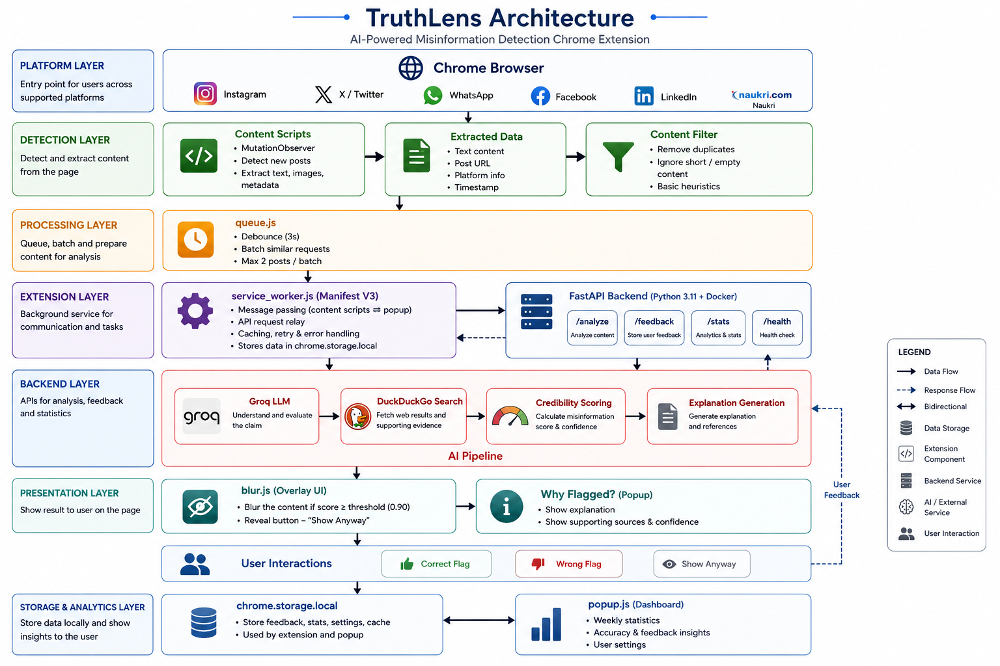

<div align="center">


<p align="center">
  
  
  
  
  
  
</p>

<p align="center">
  
  
  
  
  
</p>

</div>

---

## 1. Overview

TruthLens is a **passive AI-powered Chrome extension** that detects and blurs misinformation on social media platforms in real time — without requiring any user action. It silently observes posts as they load, analyzes them using Groq's LLM, verifies claims with DuckDuckGo search grounding, and overlays flagged content with a blur, a confidence-scored label, and a full explanation popup.

Built for the everyday social media user who wants protection from misinformation without changing their browsing habits.

> **No clicks. No interruptions. Just silent, intelligent protection.**

---

## 2. Highlights

| Highlight | Detail |
|-----------|--------|
| 🔍 Passive Detection | Scans posts silently using MutationObserver — zero user effort required |
| 🤖 Groq AI | llama-3.1-8b-instant — fast, accurate, sub-second inference |
| 🌐 Search Grounding | DuckDuckGo verifies flagged claims before blurring — reduces false positives |
| 📊 Weekly Dashboard | Popup shows posts scanned, flagged count, flag rate, and category breakdown |
| 💬 Explanation UI | "Why flagged?" popup with category, confidence score, and one-line AI reasoning |
| 👍 Feedback Loop | Users mark flags as correct or wrong — feedback sent to backend for improvement |
| 🐳 Dockerized | Backend containerized and ready for cloud deployment on Render / Railway |
| 🛡️ 90% Threshold | Only flags when AI is 90%+ confident — strict threshold minimizes false positives |
| 🌍 6 Platforms | Instagram, Twitter/X, WhatsApp Web, Facebook, LinkedIn, Naukri |
| 🔒 Privacy First | All data stays local — no cloud storage, no user accounts, no tracking |

---

## 3. Problem Statement

Social media has become the primary source of news and information for billions of people. However, it is also the fastest-spreading vector for misinformation, fake job postings, health myths, and scam courses — particularly targeting students and freshers in India.

| Problem | Evidence |
|---------|----------|
| Misinformation spreads 6x faster than truth on social media | MIT Study, 2018 |
| 59% of links shared on social media are never read before sharing | Columbia University |
| Fake job postings targeting freshers cause financial and career damage | NASSCOM Report |
| Health misinformation during crises leads to real-world physical harm | WHO Advisory |
| Scam courses with "100% placement guaranteed" claims defraud lakhs of students | Consumer Forum Reports |
| No passive, real-time misinformation filter exists for regular end users | Gap in the market |

Existing fact-checking tools (Snopes, AltNews, etc.) require users to manually submit content for verification — a friction point that most users skip entirely. No tool works silently in the background, the way an ad blocker does for advertisements.

**TruthLens fills this gap.**

---

## 4. Proposed Solution

TruthLens works like an ad blocker for misinformation — installed once, runs silently, protects automatically.

```
User opens Instagram / Twitter / Facebook / WhatsApp / LinkedIn / Naukri
        ↓
MutationObserver detects new posts loading into the DOM
        ↓
Post text extracted and batched (max 2 posts per call, 3s debounce)
        ↓
Chrome Service Worker relays batch to FastAPI backend (localhost:8001)
        ↓
Groq AI (llama-3.1-8b-instant) analyzes each post against 6 categories
        ↓
If flagged at 90%+ confidence → DuckDuckGo search grounding verifies the claim
        ↓
If still flagged → blur overlay applied with label, confidence score, and buttons
        ↓
User options: Show Anyway | See Explanation | Give Feedback (Correct / Wrong)
        ↓
Stats tracked in chrome.storage.local → visible in popup dashboard
```

---

## 5. Features

### Core Detection Engine
- Real-time post scanning on 6 social media platforms
- AI-powered classification into 6 distinct misinformation categories
- DuckDuckGo search grounding to remove false positives before blurring
- Strict 90% confidence threshold — only flags when truly certain
- Debounced batch queue — groups posts to minimize API calls and respect rate limits

### Blur Overlay UI
- Blurs flagged post image/content with a dark overlay
- Red label showing detected category and confidence percentage
- **"Show Anyway"** — instantly unblurs and dismisses the overlay
- **"Why flagged?"** — opens a detailed explanation popup

### Explanation Popup
- Category badge (fake_news, scam_course, fake_job, etc.)
- Confidence score displayed prominently
- One-sentence AI-generated explanation for why the post was flagged
- **"Correctly flagged"** and **"Wrong flag"** feedback buttons
- Feedback submitted to backend via POST /feedback endpoint

### Weekly Stats Dashboard (Extension Popup)
- Total posts scanned this week
- Total posts flagged this week
- Flag rate percentage
- Category breakdown with animated progress bars (fake_news, scam_course, etc.)
- Reset weekly stats button

### Multi-Platform DOM Scanning
| Platform | Selector Strategy |
|----------|-------------------|
| Instagram | `article` (structural, stable) |
| Twitter / X | `article[data-testid="tweet"]` |
| WhatsApp Web | `[data-testid="msg-container"]` |
| Facebook | `div[data-pagelet]` |
| LinkedIn | `.feed-shared-update-v2` |
| Naukri | `.jobTuple` job cards |

---

## 6. Architecture Diagram



> *Place your architecture diagram image as `architecture-diagram.png` in the root of this repository.*

---

## 7. Architecture Highlights

| Component | Technology | Role |
|-----------|-----------|------|
| Content Scripts | Vanilla JS + MutationObserver | Passively scan DOM for new posts on each platform |
| Unique Post ID | `encodeURIComponent` + alphanumeric slice | Unicode-safe ID generation for Tamil, Hindi, emoji text |
| Batch Queue | `queue.js` — debounce 3s, max 2 posts | Reduces API calls, respects Groq free tier rate limits |
| Service Worker | Chrome MV3 Background Script | Relays messages from content scripts to backend via fetch |
| FastAPI Backend | Python 3.11, async | Handles concurrent AI calls using `asyncio.get_running_loop()` + `ThreadPoolExecutor` |
| AI Model | Groq — llama-3.1-8b-instant | Sub-second inference, structured JSON output, temperature 0.1 for consistency |
| Search Grounding | DuckDuckGo Search API | Verifies flagged claims against real search results before applying blur |
| Blur Overlay | `blur.js` — pure DOM manipulation | Applies CSS blur + absolute overlay — no modification of original content |
| Dashboard | `popup.js` + `chrome.storage.local` | External JS file to comply with MV3 Content Security Policy |
| Containerization | Docker (python:3.11-slim) | Lightweight image, port 8001, env-file for secrets |

---

## 8. Data Flow

```
① User scrolls social media feed
      │
      ▼
② MutationObserver fires on newly added DOM nodes
      │
      ▼
③ scanNode() → extractPost()
      │  Returns: { id, text, images[], platform }
      │  ID: "ig-" + encodeURIComponent(text.slice(0,80)) + "-" + count
      ▼
④ TruthLensQueue.add(post)
      │  Dedup check by ID → push to queue array
      ▼
⑤ flush() triggers
      │  Condition: debounce 3000ms OR queue.length >= 2
      ▼
⑥ chrome.runtime.sendMessage({ type: "ANALYZE_BATCH", posts: batch })
      │
      ▼
⑦ service_worker.js receives message
      │  fetch("http://localhost:8001/analyze", { method: "POST", body: JSON.stringify({ posts }) })
      ▼
⑧ FastAPI POST /analyze
      │  loop = asyncio.get_running_loop()
      │  tasks = [loop.run_in_executor(None, analyze_post, post) for post in posts]
      │  results = await asyncio.gather(*tasks)
      ▼
⑨ groq_service.analyze_post(post)
      │  Groq(llama-3.1-8b-instant) → raw JSON string
      │  Parse: { flagged, confidence, category, explanation }
      ▼
⑩ Search Grounding Check
      │  IF flagged AND confidence >= 0.90:
      │    → search_service.verify_claim(post.text)
      │    → DuckDuckGo search → result snippets
      │    → Verified as REAL? → flagged = False, confidence = 0.0
      ▼
⑪ AnalyzeBatchResponse returned to service worker
      │  { results: [{ id, flagged, confidence, category, explanation }] }
      ▼
⑫ queue.js → updateStats(results, batchSize)
      │  chrome.storage.local: scanned++, flagged++, categories[cat]++
      ▼
⑬ blur.js → applyResults(results)
      │  Filter: result.flagged === true AND result.confidence >= 0.90
      │  Find: document.querySelector([data-tl-id="${result.id}"])
      ▼
⑭ applyBlur(el, result)
      │  el.style.filter = "blur(6px)"
      │  Append overlay div with label + buttons
      ▼
⑮ User interaction
      │  "Show Anyway" → remove blur + overlay
      │  "Why flagged?" → showExplanation() fixed popup bottom-right
      ▼
⑯ User feedback
      │  "Correctly flagged" / "Wrong flag"
      │  → chrome.runtime.sendMessage({ type: "SUBMIT_FEEDBACK" })
      │  → service_worker → POST /feedback
      ▼
⑰ Popup dashboard
      └── chrome.storage.local.get("tl_stats") → render numbers + bars
```

---

## 9. Project Structure

```
TruthLens/
│
├── backend/                            # FastAPI backend
│   ├── core/
│   │   └── config.py                   # Pydantic settings — reads GROQ_API_KEY from .env
│   ├── models/
│   │   └── database.py                 # SQLAlchemy models (future use)
│   ├── routers/
│   │   ├── analyze.py                  # POST /analyze — concurrent batch AI analysis
│   │   └── feedback.py                 # POST /feedback — user feedback ingestion
│   ├── schemas/
│   │   └── content.py                  # Pydantic request/response models
│   ├── services/
│   │   ├── groq_service.py             # Groq LLM analysis + DuckDuckGo grounding
│   │   └── search_service.py           # DuckDuckGo claim verification logic
│   ├── main.py                         # FastAPI app entry point + CORS middleware
│   └── requirements.txt                # Python dependencies
│
├── extension/                          # Chrome MV3 Extension
│   ├── background/
│   │   └── service_worker.js           # MV3 background service worker
│   ├── content_scripts/
│   │   ├── instagram.js                # Instagram DOM scanner
│   │   ├── twitter.js                  # Twitter/X DOM scanner
│   │   ├── facebook.js                 # Facebook DOM scanner
│   │   ├── whatsapp.js                 # WhatsApp Web DOM scanner
│   │   ├── linkedin.js                 # LinkedIn DOM scanner
│   │   └── naukri.js                   # Naukri job card scanner
│   ├── utils/
│   │   ├── queue.js                    # Debounced batch queue + stats tracking
│   │   └── blur.js                     # Blur overlay + explanation popup + feedback UI
│   ├── popup/
│   │   ├── index.html                  # Dashboard HTML structure
│   │   └── popup.js                    # Dashboard JS (external for MV3 CSP compliance)
│   ├── icons/
│   │   ├── icon16.png
│   │   ├── icon48.png
│   │   └── icon128.png
│   └── manifest.json                   # Chrome MV3 manifest
│
├── Dockerfile                          # Backend Docker image (python:3.11-slim, port 8001)
├── docker-compose.yml                  # Multi-service Docker compose
├── architecture-diagram.png            # System architecture diagram
├── .gitignore
└── README.md
```

---

## 10. Tech Stack

### Extension Layer
| Technology | Version | Purpose |
|-----------|---------|---------|
| Chrome Manifest V3 | V3 | Extension framework and permissions |
| Vanilla JavaScript | ES2022 | Content scripts, service worker, popup |
| MutationObserver API | Browser Native | Real-time DOM change detection |
| chrome.storage.local | Chrome API | Weekly stats persistence |
| chrome.runtime.sendMessage | Chrome API | Content script ↔ Service worker IPC |

### Backend Layer
| Technology | Version | Purpose |
|-----------|---------|---------|
| FastAPI | 0.111+ | REST API framework |
| Python | 3.11 | Runtime |
| Groq SDK | Latest | LLM inference (llama-3.1-8b-instant) |
| duckduckgo-search | Latest | Search grounding for claim verification |
| Pydantic | v2 | Request/response validation |
| asyncio | Built-in | Async concurrent execution |
| Uvicorn | Latest | ASGI server |

### Infrastructure
| Technology | Purpose |
|-----------|---------|
| Docker (python:3.11-slim) | Lightweight backend container |
| docker-compose | Multi-service orchestration |
| python-dotenv | Secure environment variable loading |

---

## 11. API Reference

### `POST /analyze`

Analyzes a batch of social media posts for misinformation.

**Request Body:**
```json
{
  "posts": [
    {
      "id": "ig-abc123-0",
      "text": "Learn coding in 30 days — 100% placement guaranteed!",
      "images": [],
      "platform": "instagram"
    }
  ]
}
```

**Response:**
```json
{
  "results": [
    {
      "id": "ig-abc123-0",
      "flagged": true,
      "confidence": 0.95,
      "category": "scam_course",
      "explanation": "This post makes an unverifiable '100% placement guaranteed' claim, a common pattern in fraudulent course advertisements."
    }
  ]
}
```

**Detection Categories:**
| Category | Triggers On |
|----------|-------------|
| `fake_news` | Fabricated news events presented as factual |
| `misleading_stats` | Deliberately manipulated or fabricated data |
| `fake_job` | Fraudulent job postings with unrealistic salary claims |
| `health_misinfo` | Dangerous false medical or health claims |
| `scam_course` | Fake "100% placement guaranteed" course advertisements |
| `fake_review` | Obviously fabricated product or service testimonials |

---

### `POST /feedback`

Submits user feedback on a flagged post for future model improvement.

**Request Body:**
```json
{
  "post_id": "ig-abc123-0",
  "correct": true,
  "timestamp": 1718601234567
}
```

**Response:**
```json
{ "status": "ok" }
```

---

### `GET /health`

Health check for the backend service.

**Response:**
```json
{ "status": "ok", "service": "TruthLens API" }
```

---

## 12. Getting Started

### Prerequisites

- Python 3.11+
- Google Chrome browser
- Docker (optional, for containerized deployment)
- Groq API key — free at [console.groq.com](https://console.groq.com)

---

### Step 1 — Clone the Repository

```bash
git clone https://github.com/venunathan07/TruthLens.git
cd TruthLens
```

---

### Step 2 — Backend Setup

```bash
# Create and activate virtual environment
python -m venv venv

# Windows
venv\Scripts\activate

# Mac / Linux
source venv/bin/activate

# Install dependencies
pip install -r backend/requirements.txt
```

---

### Step 3 — Configure Environment Variables

Create the file `backend/.env`:
```env
GROQ_API_KEY=your_groq_api_key_here
```

> Get your free API key at [console.groq.com](https://console.groq.com)

---

### Step 4 — Run the Backend

**Option A — Direct (Development):**
```bash
uvicorn backend.main:app --reload --host 0.0.0.0 --port 8001
```

**Option B — Docker (Recommended):**
```bash
# Build image
docker build -t truthlens-api .

# Run container
docker run -d -p 8001:8001 --env-file backend/.env --name truthlens_backend truthlens-api

# Start / Stop
docker start truthlens_backend
docker stop truthlens_backend

# View logs
docker logs truthlens_backend
```

Verify the backend is running: [http://localhost:8001/docs](http://localhost:8001/docs)

---

### Step 5 — Load the Chrome Extension

1. Open Chrome and navigate to `chrome://extensions`
2. Enable **Developer mode** (toggle in top right corner)
3. Click **Load unpacked**
4. Select the `extension/` folder from this repository
5. Click the puzzle piece icon in the Chrome toolbar → pin **TruthLens**

---

### Step 6 — Start Using TruthLens

1. Make sure the backend is running (Step 4)
2. Open Instagram, Twitter, WhatsApp Web, Facebook, LinkedIn, or Naukri
3. Scroll through your feed normally
4. Flagged posts will **blur automatically** with a red label
5. Click **"Why flagged?"** for a full explanation
6. Click the **TruthLens icon** in the toolbar to see your weekly dashboard

---

## 13. Scalability

| Concern | Current Implementation | Path to Scale |
|---------|------------------------|---------------|
| Batch Size | Max 2 posts per API call | Increase `MAX_BATCH` in `queue.js` |
| Debounce Delay | 3000ms | Reduce to 1000ms for faster detection |
| Concurrent AI Calls | `ThreadPoolExecutor` (sync Groq client) | Migrate to async Groq client |
| Backend Hosting | Local Docker on port 8001 | Deploy on Render / Railway / Fly.io |
| Groq Rate Limit | ~30 RPM on free tier | Upgrade plan or implement Redis request queue |
| Multi-User Support | Single-user Chrome extension | Add JWT auth + per-user Redis queue for SaaS |
| Stats Storage | `chrome.storage.local` (device-only) | Sync to backend DB for cross-device dashboard |
| Search Grounding | DuckDuckGo (free, no API key) | Upgrade to Google Custom Search API |
| Platform Coverage | 6 platforms | Add YouTube, Telegram, Reddit content scripts |
| Model Size | llama-3.1-8b-instant (fast, lighter) | Upgrade to llama-3.1-70b for higher accuracy |

---

## 14. Known Issues

| Issue | Status | Resolution |
|-------|--------|-----------|
| Sports statistics posts occasionally flagged as `fake_news` | 🔴 Open | System prompt refinement needed |
| Humor and sarcasm misclassified as `health_misinfo` | 🔴 Open | Context-awareness improvement needed |
| Overlay buttons low contrast on dark-background posts | 🔴 Open | Increase overlay opacity / button brightness |
| ZapTalk Docker conflict on port 8000 | ✅ Resolved | TruthLens permanently moved to port 8001 |
| `btoa()` crash on Tamil / Hindi / emoji text | ✅ Resolved | Replaced with `encodeURIComponent` across all 6 platforms |
| MV3 service worker cache causing 405 errors | ✅ Resolved | Full extension reinstall clears stale cache |
| `asyncio.get_event_loop()` deprecated on Python 3.12+ | ✅ Resolved | Replaced with `asyncio.get_running_loop()` |
| Popup inline script blocked by MV3 Content Security Policy | ✅ Resolved | Moved all popup JS to external `popup.js` file |
| Groq API key accidentally committed to git history | ✅ Resolved | History rewritten with `git checkout --orphan` |
| Groq rate limit on free tier (~30 RPM) | 🟡 Active | Posts skipped silently when rate limited |

---

## 15. Future Improvements

| # | Improvement | Description |
|---|-------------|-------------|
| 1 | 📱 Mobile App | Build a native Android / iOS app so users can use TruthLens on mobile browsers and apps, not just desktop Chrome |
| 2 | ♾️ Unlimited Scans | Remove rate limit bottleneck by self-hosting an open-source LLM (Ollama + llama3) locally or upgrading to paid Groq — enabling unlimited post scanning with zero throttling |
| 3 | 🎯 Accuracy Improvement (79% → 90–100%) | Fine-tune detection prompts, add few-shot examples for sports/humor/sarcasm edge cases, upgrade to llama-3.1-70b for significantly higher precision |
| 4 | 📺 YouTube Support | Scan video titles, descriptions, pinned comments, and community posts for misinformation |
| 5 | ✈️ Telegram Web Support | Add scanning for Telegram Web messages and public channel posts |
| 6 | 🤝 Reddit Support | Detect misinformation in Reddit post titles, flairs, and top-level comments |
| 7 | 📊 Dashboard UI Improvement | Redesign popup with pie/bar charts, daily breakdown timeline, platform-wise stats, dark/light theme toggle |
| 8 | 🌐 Multilanguage Support | Improve detection for Tamil, Hindi, Bengali, Telugu, and mixed-language posts |
| 9 | 🔗 Evidence Source Links | Show verified source links (WHO, Reuters, Snopes, AltNews) inside the "Why flagged?" popup |
| 10 | ✅ Allowlist Trusted Accounts | Let users whitelist verified news organizations to skip scanning entirely |
| 11 | 📄 Export Report | Generate weekly / monthly PDF report of misinformation exposure by platform and category |
| 12 | 🔔 Browser Notifications | Push Chrome notification when high-confidence misinformation is detected even when tab is not active |
| 13 | 🟡 Severity Levels | Replace binary flag/no-flag with three levels (Low / Medium / High) with different overlay colors per severity |

## 16. License

```
Academic & Learning Use License

Copyright (c) 2026 Venunathan Prakash

Developed for academic and learning purposes only.
Not intended for commercial use or redistribution without permission.

This project was built as part of a personal portfolio to demonstrate
skills in AI integration, Chrome Extension development, FastAPI backend
engineering, and real-time DOM processing.

Permission is granted to view, study, and fork this repository for
personal learning. Any commercial use, resale, or redistribution of
this codebase or its derivatives requires explicit written permission
from the author.
```

---

<div align="center">

**Built with ❤️ by Venunathan Prakash**
*B.E. Computer Science*

[](https://github.com/venunathan07)
[](https://linkedin.com/in/venunathan-prakash)
[](https://venunathan.vercel.app)


</div>
